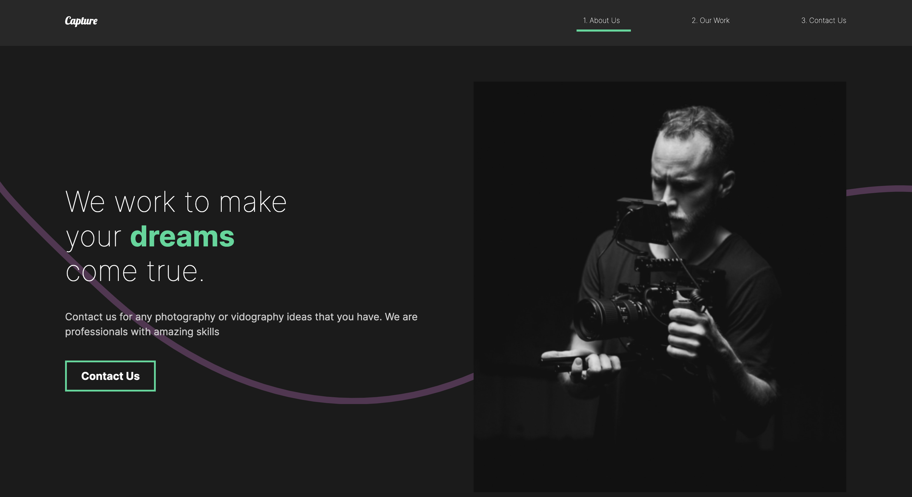

# Capture Portfolio

## Table of contents

- [Overview](#overview)
  - [The challenge](#the-challenge)
  - [Screenshot](#screenshot)
  - [Links](#links)
- [My process](#my-process)
  - [Built with](#built-with)
- [Linkedin](#linkedin)
- [Getting Started with Create React App](#getting-started-with-create-react-app)

## Overview

### The challenge

Users should be able to:

- Navigate through the portfolio
- Experience the small animations
- Have a seamless experience on both mobile and desktop devices.

### Screenshot

### Links

- [Live Site URL](https://main--cc-music-app.netlify.app/)

## My process

### Built with

- [React](https://reactjs.org/) - JS library
- [Styled componenets](https://styled-components.com/) - For styles
- [Framer] (https://www.framer.com/motion/) - For animations

## Linkedin
- [https://www.linkedin.com/in/camillecalas](https://www.linkedin.com/in/camillecalas/)

## Getting Started with Create React App

In the project directory, you can run:
`npm install`(to make sure you have all the depedencies)
`npm start`
Runs the app in the development mode.
Open http://localhost:3000 to view it in your browser.
